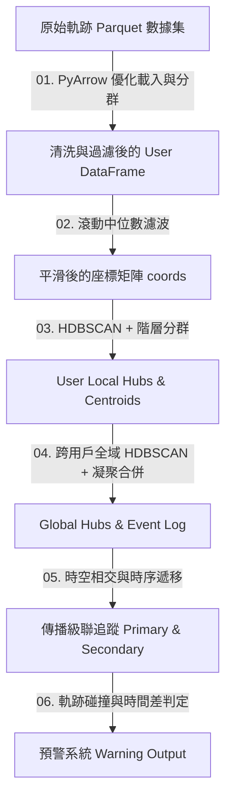

# TGIS 軌跡拓樸分析與傳播級聯預警系統 —— 完整運作流程流水帳

本文件以「輸入 $\rightarrow$ 處理 (參數設定) $\rightarrow$ 輸出 (暫時結果) $\rightarrow$ 下一步」的流水帳 (Pipeline) 形式，詳盡梳理 TGIS 系統中所有元件的執行邏輯、參數設定、資料格式以及每一步驟的**物理意義**。

---

## 📌 系統全景架構與執行流程 (Pipeline Overview)

---

## 🗂️ 零、原始資料集格式 (Dataset Format)

在進入流程前，系統必須輸入特定格式的結構化軌跡數據。

*   **資料檔案類型**：`Apache Parquet`（例如 [cityA-dataset.parquet](file:///c:/Users/ss348/Desktop/TGIS/data/cityA-dataset.parquet)）
*   **資料欄位結構、類型與物理意義**：
    | 欄位名稱 | 資料類型 | 數值範圍 / 範例 | 物理意義 |
    | :--- | :--- | :--- | :--- |
    | `uid` | `int64` | `0` 到 `99999` (各城市範圍不同) | **用戶唯一識別碼**：區分不同的移動個體，用於追蹤個人的軌跡序列。 |
    | `x` | `float64` | 例如 `451234.56` (米) | **X 軸投影座標**：採用 UTM 投影平面座標系，代表地圖上東西向的絕對物理距離（以米為單位）。 |
    | `y` | `float64` | 例如 `2812345.67` (米) | **Y 軸投影座標**：採用 UTM 投影平面座標系，代表地圖上南北向的絕對物理距離（以米為單位）。 |
    | `d` | `int64` | `1` 到 `30` | **觀測日期 (Day)**：以天為單位的整數索引，區分不同日期的活動。 |
    | `t` | `int64` | `1` 到 `48` | **時間步索引 (Time slot)**：將 24 小時劃分成 48 個時段（每 30 分鐘為 1 步）。如 `1` 代表 00:00~00:30，`48` 代表 23:30~24:00。 |

*   **物理意義**：
    該格式代表「**某位特定用戶**（`uid`）在**哪一天**（`d`）的**哪一個半小時**（`t`）內，其移動軌跡的**平面物理位置**（`x`, `y`）」。

---

## 1️⃣ 第一階段：資料載入與自適應子抽樣 (Data Loading & Adaptive Sub-sampling)

*   **輸入 (Input)**：
    *   原始 Parquet 資料路徑（例如 `data/cityA-dataset.parquet`）
    *   **參數設定**：
        *   `numUsers` = `3000` (欲載入的用戶數上限，可在網頁端或實驗腳本設定)
*   **處理邏輯與步驟**：
    1.  **用戶 ID 先行讀取**：使用 `pyarrow` 僅讀取 parquet 檔案的 `uid` 單一欄位。
    2.  **提取前 $N$ 個用戶**：對所有不重複的 `uid` 進行排序，截取前 `numUsers` 位用戶，得到 `selected_uids` 列表。
    3.  **精確條件篩選載入**：利用 PyArrow 篩選器（`filters=[('uid', 'in', selected_uids)]`）重新讀取 Parquet，僅載入這 `numUsers` 位用戶的完整行資料。
    4.  **無效資料清洗 (Dropna)**：刪除在 `x`、`y`、`d`、`t` 中含有 `NaN` 或空白值的任何記錄。
    5.  **時空序列排序**：將載入的資料集依 `['uid', 'd', 't']` 進行正向排序。
*   **輸出與中間結果 (Output)**：
    *   清洗並排序後的 Pandas DataFrame (`select_df`)，包含前 $N$ 個用戶的所有有效時空軌跡點。
*   **物理意義**：
    *   **記憶體防溢出優化 (OOM Prevention)**：像 City A 資料集包含上億筆資料（約數 GB），直接整檔載入會導致伺服器記憶體崩潰。先行讀取 `uid` 並篩選，只載入子集的作法可以將記憶體佔用控制在數十 MB 內，實現秒級載入。
    *   **軌跡連續性保障**：刪除噪聲行並依時間排序，確保後續的時間滑動濾波與分群演算法具有正確的「時間遞移關係」。

---

## 2️⃣ 第二階段：軌跡平滑去噪 (Trajectory Smoothing)

此步驟針對「單一用戶」在所有日期下的所有軌跡點進行空間去噪。

*   **輸入 (Input)**：
    *   單一用戶 `uid` 的原始時空座標序列 `user_df[['x', 'y']]`
    *   **參數設定**：
        *   `smoothing_window (W)` = `5` (可依據實驗設定為 `3`, `5` 或 `7`，決定滑動視窗的大小)
        *   `center` = `True` (使平滑結果與當前時間點對齊，防止相位漂移)
        *   `min_periods` = `1` (即使邊角窗口不足 $W$ 個點，也能進行中位數計算，避免邊界點丟失)
*   **處理邏輯與步驟**：
    1.  對於 $x$ 與 $y$ 座標，分別套用「滑動中位數濾波器」：
        $$\text{smooth\_x}[i] = \text{median}\left(x[i - \lfloor W/2 \rfloor : i + \lfloor W/2 \rfloor]\right)$$
        $$\text{smooth\_y}[i] = \text{median}\left(y[i - \lfloor W/2 \rfloor : i + \lfloor W/2 \rfloor]\right)$$
    2.  將平滑後的雙軸座標向量重新組裝成二維坐標矩陣。
*   **輸出與中間結果 (Output)**：
    *   該用戶平滑後的二維座標矩陣 `coords` ($N \times 2$)，其中每一行代表一個平滑後的位置 $(x_{\text{smooth}}, y_{\text{smooth}})$。
*   **物理意義**：
    *   **消除隨機漂移與定位抖動**：真實的 GPS 數據常因為高樓遮蔽或多路徑效應，在短時間內出現幾十公尺的「彈跳點」。
    *   **保留真實活動路徑**：使用「中位數」而非「平均數」濾波。因為中位數一定會從視窗內的「真實歷史座標點」中選取，能保留真實的路網邊界；而平均數會產生「虛擬的中心點」，導致用戶軌跡彷彿穿牆或漂移到路外。

---

## 3️⃣ 第三階段：個人局域樞紐站點提取 (Local Hubs Extraction)

將每個用戶去噪後的軌跡點歸納為個人活動錨點。

*   **輸入 (Input)**：
    *   單一用戶平滑後的座標矩陣 `coords` ($N \times 2$)
    *   **參數設定**：
        *   `min_cluster_sizes` = `[15]`（為確保系統穩定與單調性，在 experiments 中固定為 `15`；在 tracer.py 內部則依序嘗試 `[15, 10, 5, 3]` 自適應，當第一個能產生 $\ge 2$ 個 Cluster 的 size 即停止）
        *   `distance_threshold` = `1.0` 米（用於凝聚層次分群的合併半徑）
        *   `linkage` = `'single'`（單一連結法，以最靠近的邊界計算聚類間距）
*   **處理邏輯與步驟**：
    1.  **使用者內密度聚類 (HDBSCAN)**：
        對該用戶的座標進行 HDBSCAN 聚類。HDBSCAN 會自動辨識多個任意形狀的高密度區域（即停留站點），並將移動中的點標記為噪聲 `-1`。
    2.  **局域中心點合併 (Agglomerative Clustering)**：
        *   計算 HDBSCAN 產生的各個聚類中點的平均座標（即初始聚類中心）。
        *   如果得到的聚類中心個數 $\ge 2$，計算它們之間的距離，對這些中心點進行凝聚層次分群（門檻值 = `1.0` 米）。
        *   若兩個聚類中心距離小於 8.0 米，則將這兩個聚類標記合併為同一個新的 Local Hub。
    3.  **計算最終局域中心 (Local Centroids)**：
        重新依據合併後的 `zone_id`，計算各聚類中所有軌跡點的平均座標 $(\bar{x}, \bar{y})$。
    4.  **產出時序停留事件**：
        將用戶原軌跡的每一行對應到其歸屬的 Local Hub ID。過濾掉移動噪聲（`Local Hub == -1`），只留下有效的停留記錄。
*   **輸出與中間結果 (Output)**：
    *   `user_local_hubs` (dict): 該用戶的 Local Hub 映射，格式為 `{local_hub_id: (x, y)}`。
    *   `all_local_centroids` (list): 該用戶的所有 Local Hub 中心座標點，格式為 `[{'uid': uid, 'l_id': l_id, 'x': x, 'y': y}]`。
    *   `hub_events` (list): 該用戶在 Local Hub 的停留時間序列日誌，格式為 `[{'uid': uid, 'd': d, 't': t, 'local_hub': local_hub_id}]`。
*   **物理意義**：
    *   **識別個人生活圈錨點**：找出用戶日常頻繁停留的地點，如「家」（`Local Hub 0`）、「辦公室」（`Local Hub 1`）。
    *   **停留閾值保證**：`min_cluster_size = 15` 代表用戶必須在該區域停留至少 15 個時間步（相當於 $15 \times 30 \text{分鐘} = 7.5 \text{小時}$），才算作一個生活樞紐，有效過濾了路過、等紅綠燈或短暫加油的非停留點。
    *   **空間合併合理化**：當 HDBSCAN 因為密度波動把同一個辦公室拆成兩個相鄰的微小聚類時，Agglomerative Clustering 以 8 米的門檻將其合併，符合一般室內建築的空間尺度。

---

## 4️⃣ 第四階段：城市級全域樞紐聚類與映射 (Global Hubs Clustering & Local-to-Global Mapping)

將所有用戶個人的生活錨點（Local Hubs）融合成城市整體的公共交通/商業節點（Global Hubs）。

*   **輸入 (Input)**：
    *   系統中所有用戶所貢獻的 Local Hub 中心座標集合 `all_local_centroids`（通常包含數千個點）
    *   **參數設定**：
        *   `min_cluster_sizes` = `[15]` 或 `[15, 10, 5, 3]` (跨用戶聚類之最小密度門檻，代表一個公共區域必須被多少個不同的局部 hubs 覆蓋)
        *   `radius_K` = `1.0` 米 (全域凝聚層次分群的合併半徑)
*   **處理邏輯與步驟**：
    1.  **全域密度聚類 (HDBSCAN)**：
        對全體用戶的 Local Hub 座標點進行大尺度聚類，找出跨用戶高度重疊的空間區域。
    2.  **全域中心點合併 (Agglomerative Clustering)**：
        *   計算各個全局聚類的平均座標，得到初始全局樞紐中心。
        *   若初始中心個數 $\ge 2$，使用凝聚層次分群（門檻值 = `radius_K` = 1.0 米）對其進行合併，消除極度靠近的重複節點。
    3.  **計算最終全域中心 (Global Centroids)**：
        重新依據合併後的全局標籤，計算該聚類內所有 Local Hub 座標點的平均值，作為該 Global Hub 的最終座標 $(\bar{X}_g, \bar{Y}_g)$。
    4.  **建立局部到全域的映射 (Mapping)**：
        建立一個二元鍵值映射表：`(uid, local_hub_id) -> global_hub_id`。如果某個使用者的 local_hub 沒有被納入任何一個 Global Hub（即去那裡的人太少，沒有形成全局聚類），則對應為 `-1`。
    5.  **組裝全域時空日誌 (Event Log)**：
        遍歷所有用戶的 `hub_events`，將其中的 `local_hub` 透過映射表轉換為對應的 `global_hub`。
*   **輸出與中間結果 (Output)**：
    *   `global_hubs` (dict): 全域公共樞紐座標字典，格式為 `{global_hub_id: (x, y)}`。
    *   `local_to_global_map` (dict): 局部至全域轉換表 `{(uid, local_hub): global_hub}`。
    *   `event_log` (DataFrame): 系統核心時空事件日誌，欄位包含 `['uid', 'd', 't', 'local_hub', 'global_hub']`。
*   **物理意義**：
    *   **提煉社會公共媒介**：個人生活圈中的私密地點（如自己家）因為只有單一用戶訪問，不會在跨用戶聚類中達標（無法滿足 `min_cluster_size >= 15` 位不同用戶的條件），會被過濾為 `-1`。
    *   **篩選公共樞紐**：只有捷運站、火車站、大型商場、辦公大樓等公共場所，才會同時出現在許多人的 Local Hubs 中，這些點會被成功提取為 **Global Hubs**。它們是整個城市中人流接觸、病毒擴散或交通瓶頸的最關鍵節點。

---

## 5️⃣ 第五階段：傳播級聯追蹤 (Epidemic & Cascade Tracing)

在給定的某天，模擬某個 Global Hub 發生事件（如疫情源頭或交通路口癱瘓）後，影響如何透過人流網路進行級聯擴散。

*   **輸入 (Input)**：
    *   第四階段組裝完成的 `event_log` DataFrame
    *   **參數設定**：
        *   `target_d` (事件發生天數，例如第 1 天)
        *   `target_global_hub` (污染或阻斷源頭 Global Hub ID，例如 `G0`)
        *   `target_t_range` = `(t_start, t_end)` (事故爆發/觀測的時間區間，例如 `[10, 15]`)
        *   `is_traffic_tab` (是否為交通阻斷模式。若為 `True`，代表只追蹤第一層直接波及對象，不進行二次級聯傳播)
*   **處理邏輯與步驟**：
    1.  **第一層直接接觸者篩選 (Primary Impact Tracing)**：
        *   過濾 `event_log` 中符合條件的記錄：日期等於 `target_d`、時間 `t` 落在 `[t_start, t_end]` 區間內，且 `global_hub` 等於 `target_global_hub`。
        *   記錄這些用戶的 ID，並計算他們每個人出現在該 Hub 的**最早時間** $t_{\text{exp}}$。
        *   將此結果記錄為初代受影響者 `primary_info`：`{uid: {'t': t_exp, 'hub': target_global_hub}}`。
    2.  **第二層間接級聯追蹤 (Secondary Impact Tracing - 僅在非交通阻斷模式下執行)**：
        *   對於每一位初代受影響用戶 $P_i$（其最早暴露時間為 $t_{\text{exp}}$）：
            *   在 `event_log` 中找出該用戶在同天較晚時間（$t > t_{\text{exp}}$）所前往的所有其他全域樞紐 $H_{\text{sec}}$（過濾掉 `-1`）。
            *   對於 $P_i$ 抵達 $H_{\text{sec}}$ 的時間步 $t_{\text{hub}}$，在 `event_log` 中檢索**在同一個時間步 $t_{\text{hub}}$ 也出現在 $H_{\text{sec}}$** 的其他所有用戶 $S_j$（即與 $P_i$ 產生同時同地接觸）。
            *   若 $S_j$ 不在初代受影響名單中，則將其標記為二代受影響者。其暴露時間記為 $t_{\text{hub}}$，暴露媒介樞紐記為 $H_{\text{sec}}$。
            *   如果 $S_j$ 可以透過多條路徑或多個時間點被間接波及，則只保留其**最早被波及**的時間與對應樞紐。
*   **輸出與中間結果 (Output)**：
    *   `primary_info` (dict): `{uid: {'t': t_exp, 'hub': target_global_hub}}` (直接暴露者及其時間)
    *   `secondary_info` (dict): `{uid: {'t': t_contact, 'hub': contact_global_hub}}` (二次波及者、接觸時間與媒介節點)
*   **物理意義**：
    *   **還原傳播鏈動態遞移**：初代受影響者在污染源頭（如 G0）吸附了風險，隨後隨著他們的日常移動，將風險「攜帶」到了其他公共樞紐（如 G3）。在此時，若有健康人健康接觸者正好也在 G3，便會被間接波及，形成級聯傳播鏈（G0 $\rightarrow$ 用戶 A $\rightarrow$ G3 $\rightarrow$ 用戶 B）。
    *   **時序因果關係約束**：傳播必須滿足「先接觸源頭、再移動、後傳給他人」的時序因果關係（$t_{\text{contact}} > t_{\text{exp}}$），本演算法嚴格限制了 $t > t_{\text{exp}}$ 的方向性，避免了時間倒流的不合理模擬。

---

## 6️⃣ 第六階段：預警與預測系統端 (Warning & Prediction System)

當系統中存在已知的時空污染/交通風險時，為特定探針用戶（Target User）的預計路徑進行安全性預測與實時警報。

*   **輸入 (Input)**：
    *   探針用戶的預計移動軌跡 `trajectory` (時空坐標點列表：`[{'time': t, 'x': x, 'y': y}]`)
    *   `event_day` (發生事故的日期)
    *   `event_hubs` (事故源頭 Global Hubs 列表，可支援多個事故源)
*   **處理邏輯與步驟**：
    1.  **建構全域污染時空風險地圖**：
        *   遍歷 `event_hubs` 中的每一個源頭 Hub，分別在 `event_day` 上執行「第五階段：傳播級聯追蹤」，取得各自的 `primary_info` 與 `secondary_info`。
        *   初始化三個全域字典：
            *   `hub_infection_times`: `{global_hub_id: risk_start_time}`（記錄每個 Hub 開始受污染的最早時間步）
            *   `hub_infection_levels`: `{global_hub_id: risk_level}`（記錄污染等級：'出事源頭', '直接影響 (Primary)', '間接影響 (Secondary)'）
            *   `hub_infection_sources`: `{global_hub_id: source_hub_id}`（記錄引起該污染的源頭 Hub）
        *   **寫入風險起點**：
            *   源頭 Hub $H_{\text{src}}$：風險時間 = `1` (從一天開始即受污染)，等級 = `'出事源頭'`，來源 = $H_{\text{src}}$。
            *   若 Primary 用戶在時間 $t$ 前往 $H_p$，則將 $H_p$ 的風險時間設為 $t$（若多個點，取最小值），等級 = `'直接影響 (Primary)'`。
            *   若 Secondary 用戶在時間 $t$ 前往 $H_s$，則將 $H_s$ 的風險時間設為 $t$（取最小值），等級 = `'間接影響 (Secondary)'`。
    2.  **軌跡碰撞與時間差檢測 (Collision Check)**：
        *   遍歷探針用戶預計路徑中的每一個時空點 $(t_{\text{user}}, x_{\text{user}}, y_{\text{user}})$：
            *   **空間距離檢測**：計算該點與系統中所有 Global Hubs $(\bar{X}_g, \bar{Y}_g)$ 的歐氏距離：
                $$\text{dist} = \sqrt{(x_{\text{user}} - \bar{X}_g)^2 + (y_{\text{user}} - \bar{Y}_g)^2}$$
            *   **判定是否進入 Hub**：若 $\text{dist} < 10.0$ 米，判定用戶此時「進入」了該全域樞紐 $H_g$。
            *   **判定是否暴露於風險**：若 $H_g$ 存在於剛建構的風險地圖中，且用戶到達時間 $t_{\text{user}} \ge \text{hub\_infection\_times}[H_g]$。
            *   **觸發警告**：一旦以上兩條件同時滿足，立即生成一筆 `warning` 記錄，包括：
                *   進入時間（格式化為 `HH:MM`）
                *   座標 $(x, y)$
                *   進入的 Hub 名稱
                *   該 Hub 的污染等級
                *   詳細警告描述訊息（例如：「*注意！時間 14:30 進入 直接影響 (Primary) Hub G3 (從 12:00 起受 G0 事故影響)。*」）
    3.  **計算與事發源頭的最近距離**：
        *   計算探針軌跡中的所有點，與所有事發源頭 `event_hubs` 座標的最小歐氏距離，輸出為 `overall_min_dist`。
*   **輸出與最終結果 (Output)**：
    *   `warnings` (list): 警告事件清單，每筆包含時間、座標、觸發 Hub、風險等級與警報訊息。
    *   `overall_min_dist` (float): 該探針軌跡與源頭樞紐的最短物理距離（公尺）。
    *   `warning_plot` (base64 PNG): 渲染後的視覺化地圖，以青藍色圓點/線條畫出探針軌跡，並在空間中標註出事源頭與所有受波及的風險 Global Hubs。
*   **物理意義**：
    *   **動態風險規避**：這是預警系統的核心。即使某個地鐵站（如 G3）在早上 9:00 是安全的，但因為 10:00 有一位初代接觸者將風險帶入，若探針用戶在 10:30 抵達 G3，系統仍能準確發出警告。這完美考量了**時間與空間的雙重滯後效應**。
    *   **高精度空間碰撞**：10.0 米的判定半徑符合一般的短距離射頻、近距離接觸或小範圍內空氣擴散的物理物理邊界，能避免虛警（False Alarm）。
